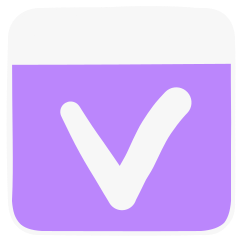
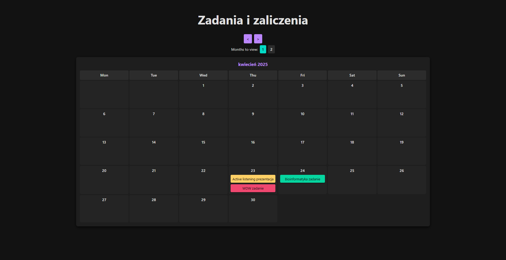

#  Vibe Calendar

Vibe Calendar is a simple React-based calendar app built to help track and visualize university deadlines, tasks, and events in a clear and aesthetic way.

https://vibe-calendar-ahgtu.ondigitalocean.app/



## Configuration

The events displayed on the calendar are configured through a JSON file named `events.json`. You need to edit this file to add, modify, or remove events from your calendar.

### `events.json` Structure

The `events.json` file should contain a JSON array of event objects. Each event object defines a single event to be displayed on the calendar. Here's the structure of an event object:

```json
{
    "title": "Event Title",
    "date": "YYYY-MM-DD",
    "active": true,
    "color": "#HEX_COLOR_CODE"
}
```
